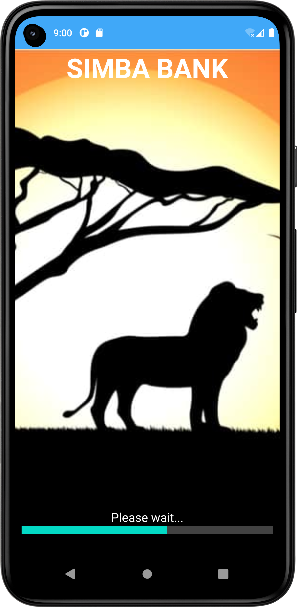
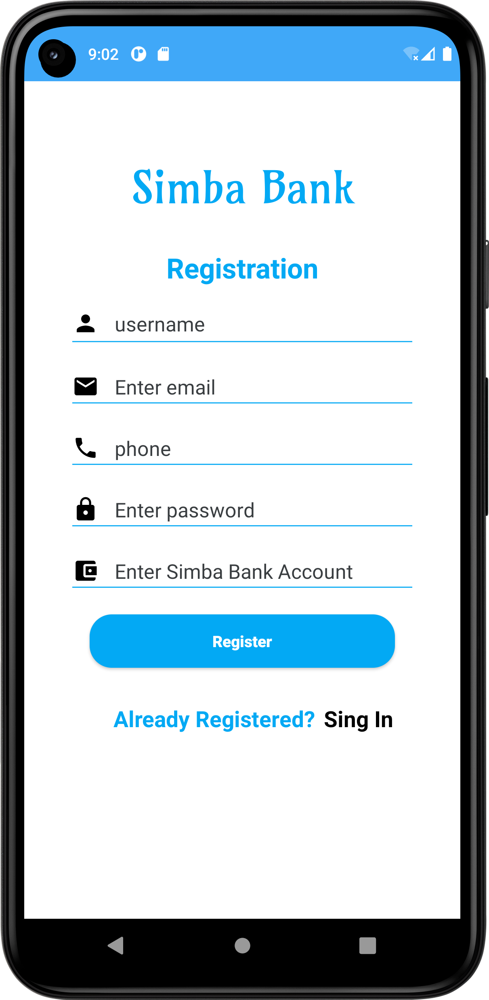
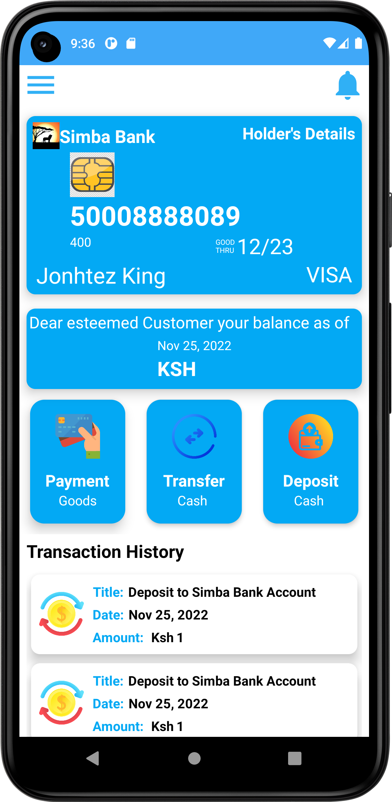

# Simba-Bank
This is an android application demonstarting a simple banking application.
## Technologies used
* Java- `Backend.`
* Jetpack Compose- `Frontend.`
* Gradle- `(For Project building).`
* Junit- `Testing`
* Firebase- `Authenticating and Storage`

# Screenshots
 

## Prerequisites
- Basic Java, Android Studio and Git knowledge, including an installed version of Git.
- Your application must run on the OpenJDK version 11 onwards.

## Setup & Installation
* Clone the project into your machine from `https://github.com/johnkaizer/Simba-Bank.git`
* Run the project in the forked root folder- gradle run.

### Getting Started with Safaricom Daraja API
1. Create an account on the [Safaricom Developer Portal] (https://developer.safaricom.co.ke/)
2. Create a Lipa na MPESA Online App  and check both Lipa na Mpesa Sandbox and Mpesa Sandbox
3. Copy and use the provided 'Secret_Key' and 'Consumer_key' in your gradle.properties file in the format:
#### DARAJA_CONSUMER_KEY="your consumer key"
#### DARAJA_CONSUMER_SECRET="your secret key"
### Libraries Used
1. [Sweet alerts] (https://github.com/pedant/sweet-alert-dialog)
2. [Butterknife] (https://github.com/JakeWharton/butterknife)
3. [Retrofit] (http://square.github.io/retrofit/)
4. [GSON] (https://github.com/google/gson)
5. [FireBase] (https://firebase.google.com/docs/android/setup)
6. [Okhttp] (http://square.github.io/okhttp/)
7. [okio] (https://github.com/square/okio)
8. [OkHttp Interceptors](https://github.com/square/okhttp/wiki/Interceptors)
9. [Timber] (https://github.com/JakeWharton/timber)
### Getting Started with Firebase
1. Log in to your email account and search [Firebase console] (https://console.firebase.google.com/)
2. Create an app and follow the instruction to the end.
3. Go to the app settings in the console and dowload the goosle gson file and paste it the project structure

## Development
Want to contribute? Great!
To fix a bug or enhance an existing module, follow these steps:

- Fork the repo
- Create a new branch (`git checkout -b improve-feature`)
- Make the appropriate changes in the files
- Add changes to reflect the changes made
- Commit your changes (`git commit -am 'Improve feature'`)
- Push to the branch (`git push origin improve-feature`)
- Create a Pull Request
